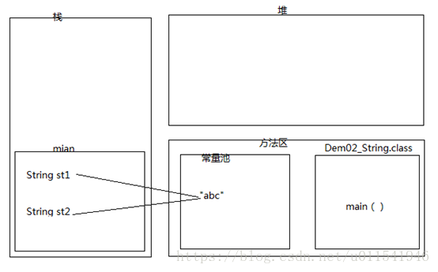
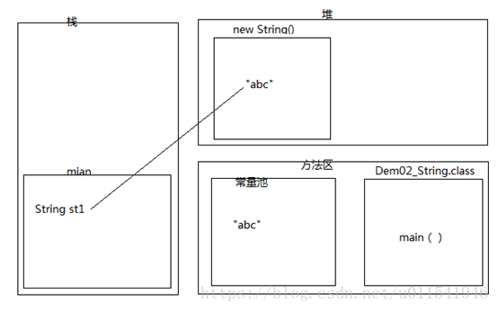
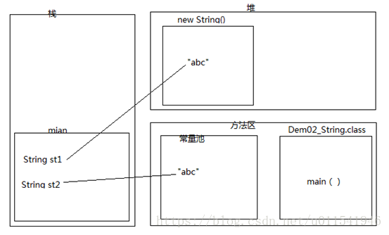
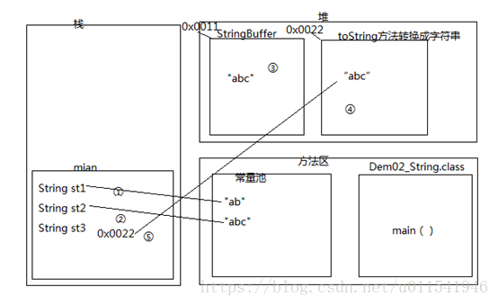

# String 基础知识
1. == 比较分为两种情况 基本类型(值比较)和引用类型(地址比较),而equal比较的是字符序列的值
     ```
    @Test
    public void testDemo1() {
        String str1 = "abc";
        String str2 = "abc";
        Assert.assertTrue(str1 == str2);
        Assert.assertTrue(str1.equals(str2));
    }
    ```
   
2. 下面的代码创建了几个对象
    ```
   String str1 = new String("abc")
   ```
   new 出来的对象都是在堆内存, 因此str1在堆内存,而"abc"指向常量池
   
3. 看下面的代码
    ```
   @Test
    public void testDemo3() {
        String str1 = new String("abc");
        String str2 = "abc";
        Assert.assertFalse(str1 == str2);
        Assert.assertTrue(str1.equals(str2));
    }
   ```
   
4. 判断下面的str1和str2是否相等
    ```
    @Test
    public void testDemo4() {
        String str1 = "a"+"b"+"c";
        //在常量池创建"abc"
        String str2 = "abc";
        //赋值以后比较
        Assert.assertTrue(str1 == str2);
        Assert.assertTrue(str1.equals(str2));
    }
   ```
5. 判断下面的字符比较
    ```
    @Test
    public void testDemo5() {
        String str1 = "ab";
        String str2 = "abc";
        String str3 = str1+ "c";
        String str4 = "ab"+"c";
        Assert.assertTrue(str2 == str4);
        Assert.assertFalse(str2 == str3);
        Assert.assertTrue(str2.equals(str3));
    }
   ```
   字符串字面量的拼接会直接存储在常量池中,如果有变量的话会使用StringBuilder拼接
   

6. 总结:
    - 什么时候拼接是在常量池中,什么时候拼接使用StringBuilder?
    - == 比较和 equal比较的区别?
    - new String("abc")和 new String("abc").intern()有啥区别;