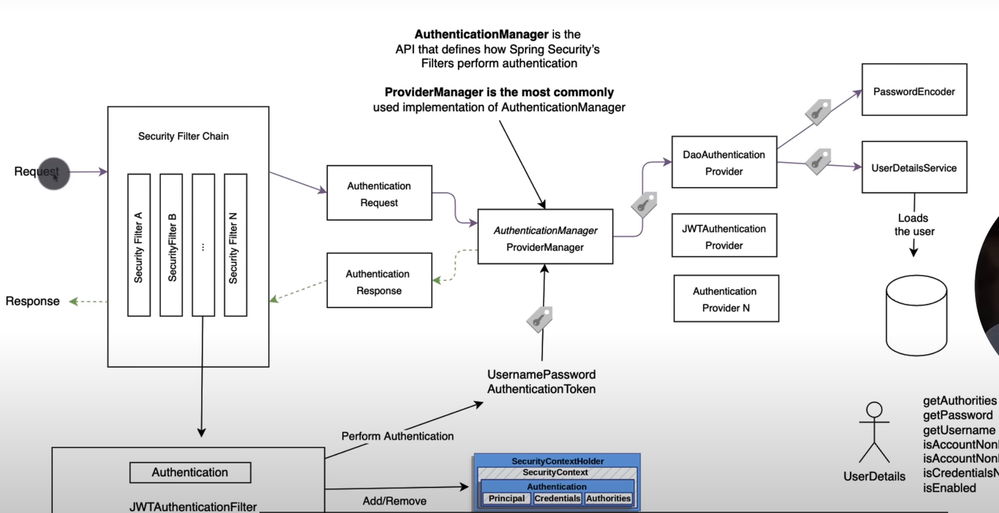

# Spring Security 源码分解

1. AuthenticationManager这个类是认证的主要类,它的实现主要是ProviderManager,而这个类聚合了多个AuthenticationProvider
   看下面的关键代码:
    ```
    private List<AuthenticationProvider> providers = Collections.emptyList();
    private AuthenticationManager parent;
   ```
   我们可以知道具体的工作是有AuthenticationProvider接口的实现类来做的,并且这个类是一个父子结构

2. AuthenticationProvider这个接口有两个方法:
      ```JAVA
       public interface AuthenticationManager {
           Authentication authenticate(Authentication authentication)
               throws AuthenticationException;
           boolean supports(Class<?> authentication);
       }
      ```
      第二个方法的作用是在迭代providers的时候，去掉认证信息不支持的AuthenticationProvider

3. 第二个部分我们需要理解AuthenticationManagerBuilder这个构建器的作用是啥,我们知道在配置的时候最后返回的肯定是SecurityFilterChain
          而这部分在不同版本有不同的配置:
    ```shell
      protected void configure(HttpSecurity http) {
          http
          // ...
          .formLogin(withDefaults());
      }
      protected void configure(AuthenticationManagerBuilder auth) throws Exception {
          auth.userDetailsService(oauthAccountUserDetailsService).passwordEncoder(passwordEncoder());
          auth.eraseCredentials(false);
      }
      public SecurityFilterChain filterChain(HttpSecurity http) {
          http
          // ...
          .formLogin(withDefaults());
      }
    ```
   此时我们需要知道HttpSecurity和AuthenticationManagerBuilder还有一个叫做WebSecurity应该是同一类的东西,那么它们是什么呢?
   AuthenticationManagerBuilder的父类是:
    ```JAVA
    public abstract class AbstractConfiguredSecurityBuilder<O, B extends SecurityBuilder<O>> extends AbstractSecurityBuilder<O> {
    }
    public abstract class AbstractSecurityBuilder<O> implements SecurityBuilder<O>{
    }
    public interface SecurityBuilder<O> {
        O build() throws Exception;
    }
    ```
   SecurityBuilder这个接口是为了构建出一个类型为O的对象,抽象类AbstractSecurityBuilder实现了这个接口,注意在这个类中使用了原子类保证构建只会构一次,但是具体的构建
   交给了子类方法doBuild去完成,同时也公开了构建的方法,这是典型的模板方法模式.AbstractConfiguredSecurityBuilder这个类有两个类型参数,第一个显然是构建的对象O,另一个参数
   叫做B类型,同时这个类型比如是SecurityBuilder<O>这个构建器的子类,也就是一个builder;同时这个类有两个关键的属性：
    ```shell
    private final LinkedHashMap<Class<? extends SecurityConfigurer<O, B>>, List<SecurityConfigurer<O, B>>> configurers = new LinkedHashMap<>();
    private final List<SecurityConfigurer<O, B>> configurersAddedInInitializing = new ArrayList<>();
    ```
   这里这两个属性存储了已经配置好的configures和configures的映射关系,因此我们要看看这个SecurityConfigurer是个啥?
    ```shell
    public interface SecurityConfigurer<O, B extends SecurityBuilder<O>> {
        void init(B builder) throws Exception;
        void configure(B builder) throws Exception;
    }
    ```
   怎么样?有点感觉了吧,这个类实际上就是配置builder,而builder通过build构建对象O,同时AbstractConfiguredSecurityBuilder有一个doBuild()方法,它调用了几个关键的方法：
    ```
    protected final O doBuild() throws Exception {
        chronized (configurers) {
            buildState = BuildState.INITIALIZING;
            //初始化
            beforeInit();
            init();

            buildState = BuildState.CONFIGURING;
            //配置
            beforeConfigure();
            configure();

            buildState = BuildState.BUILDING;
            //构建
            O result = performBuild();

            buildState = BuildState.BUILT;

            return result;
        }
    }
   ```
   在这里init和configure其实就是执行configurers的init和configure方法
4. 有了以上基础知识,我们就知道AuthenticationManagerBuilder这个类的作用是通过配置AuthenticationManagerBuilder产生一个AuthenticationManager
    因此这个builder一定有很多配置方法,比如:
   - 我们可以看看第一个增加内存认证的方法:
      ```
     public InMemoryUserDetailsManagerConfigurer<AuthenticationManagerBuilder> inMemoryAuthentication()
         throws Exception {
         return apply(new InMemoryUserDetailsManagerConfigurer<>());
     }
      ```
     在这里我们需要理解什么是configurer?因为在我们的源码中出现了很多configurer,可以看看InMemoryUserDetailsManagerConfigurer的继承关系
   首先这个类继承了UserDetailsManagerConfigurer而这个类又继承了UserDetailsServiceConfigurer而这个类又继承了AbstractDaoAuthenticationConfigurer
   而上面的类继承了UserDetailsAwareConfigurer

5. 为什么HttpSecurity有一个authenticationProvider而AuthenticationManagerBuilder也有authenticationProvider方法,它们的区别是什么?
   请看这篇文档<https://stackoverflow.com/questions/53404327/what-is-the-difference-between-registering-an-authenticationprovider-with-httpse>

6. 一个请求的请求路径图示:
   
7. 一个AuthenticationManagerBuilder的默认实现类是DefaultPasswordEncoderAuthenticationManagerBuilder
   这个类是AuthenticationConfiguration类的内部实现类,被配置为一个bean
   ```shell
      @Bean
      public AuthenticationManagerBuilder authenticationManagerBuilder(
            ObjectPostProcessor<Object> objectPostProcessor, ApplicationContext context) {
        LazyPasswordEncoder defaultPasswordEncoder = new LazyPasswordEncoder(context);
        AuthenticationEventPublisher authenticationEventPublisher = getBeanOrNull(context, AuthenticationEventPublisher.class);

        DefaultPasswordEncoderAuthenticationManagerBuilder result = new DefaultPasswordEncoderAuthenticationManagerBuilder(objectPostProcessor, defaultPasswordEncoder);
        if (authenticationEventPublisher != null) {
            result.authenticationEventPublisher(authenticationEventPublisher);
        }
        return result;
      }
   ```
   配置了一个对象处理器和密码处理器,同时这个类还返回三个configurer,这里有一个技巧就是密码处理器是从容器中配置的一个PasswordEncoder,因此这个配置用户可以自定义为bean
8. AuthenticationConfiguration类中还有三个configurer,分别是enableGlobalAuthenticationAutowiredConfigurer,
   initializeUserDetailsBeanManagerConfigurer,initializeAuthenticationProviderBeanManagerConfigurer,这几个bean主要为AuthenticationManagerBuilder配置初始化信息
   其中第二个bean为builder配置了认证管理器是DaoAuthenticationProvider,而第三个bean则是从容器中获取,第二个先执行,配置一个默认的值,第三个后执行,配置用户自定义的认证管理器.
   AuthenticationManagerBuilder父认证器要么是自定义的，要么是DaoAuthenticationProvider,同时这个还有一个authenticationProviders数组,因此可以做到链式验证.而链式的认证管理器通过
   HttpSecurity添加进来,从而可以在不同的url中实现个性化的验证.

9. 而在HttpSecurity构造函数中将认证builder传入进行共享,从而可以在HttpSecurity中拿出AuthenticationManagerBuilder,这是通过方法getAuthenticationRegistry实现的
   在getHttp这个方法中可以看到一个基本的HttpSecurity的基本配置,这个配置最终生成的是DefaultSecurityFilterChain,其实就是一个SecurityFilterChain,同时我们可以看出来的就是，如果有多个
   HttpSecurity,那么就一定会有多个SecurityFilterChain,我们再结合WebSecurity的init方法,可以知道这些SecurityFilterChain实际上是注入到一个代理类中
   具体的代码在这个类的performBuild方法,这个代理filter实际上是注册到servlet中的

10. 我们总结一下关系,WebSecurity---->FilterChainProxy; HttpSecurity------>DefaultSecurityFilterChain;AuthenticationManagerBuilder------->ProviderManager;
   同时我们再WebSecurityConfiguration这个类中看到WebSecurity是如何创建和初始化的