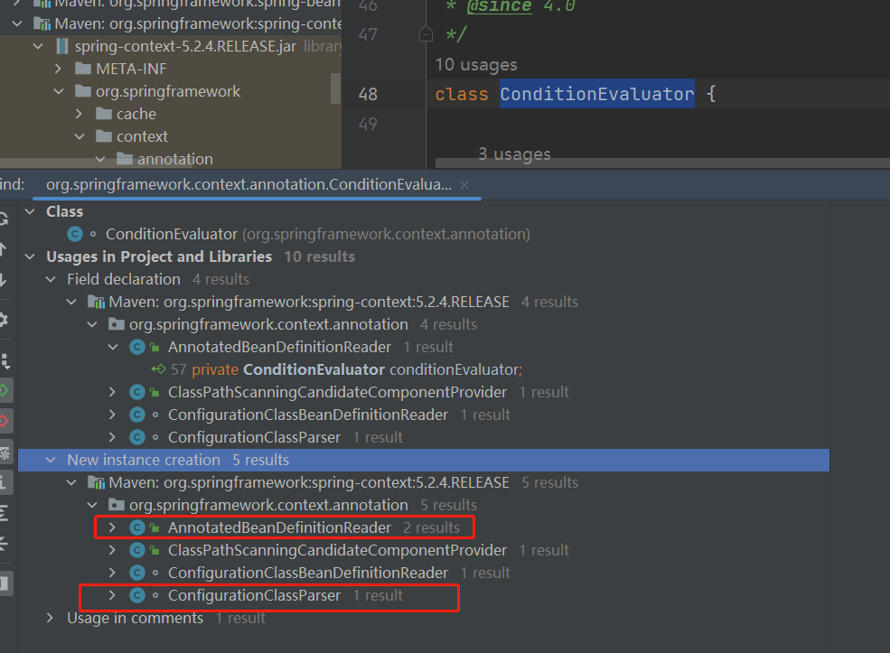

# 一次搞懂spring @Conditional注解
1. 这个注解可以用在类和方法上,传入的参数是一个类数组;还有一个Condition接口，参数是ConditionContext接口和AnnotatedTypeMetadata接口;这两个参数接口一个获取容器信息,一个获取注解元数据信息,对于我们
    通过注解元数据来管理bean的功能足足够用;每个注解都匹配一些元数据值和条件判断接口:比如ConditionalOnClass注解的元数据包括匹配的类和匹配的类名以及一个用于匹配的接口OnClassCondition.class
    同理ConditionalOnBean注解也是类似的结构
2. 注解的参数接口如下:
   ```JAVA
    public interface Condition {
        // ConditionContext内部会存储Spring容器、应用程序环境信息、资源加载器、类加载器
        boolean matches(ConditionContext context, AnnotatedTypeMetadata metadata);
    }
   ```
   同时注意Conditional注解的参数可以应用多个Condition接口,所有条件都满足,这个注解修饰的的组件才能满足;另外一点是Condition接口有一个子接口
   ConfigurationCondition,这个接口如下:
    ```JAVA
    public interface ConfigurationCondition extends Condition {

        ConfigurationPhase getConfigurationPhase();
    
        public static enum ConfigurationPhase {
    
            PARSE_CONFIGURATION,
    
            REGISTER_BEAN
        }
    
    }
    ```
   这个接口用于判断条件注解的生效阶段,解析阶段及时匹配也不能生成bean

3. 另一个重要的接口就是SpringBootCondition,这个接口实现了matches方法,它有一个抽象方法
    ```SHELL
   public abstract ConditionOutcome getMatchOutcome(ConditionContext context, AnnotatedTypeMetadata metadata);
    ```
   这个方法由子类实现,返回匹配输出

   有了以上的条件匹配之后,现在遇到一个问题,springboot是怎么使用这些条件的呢?关键在一个类:
      ConditionEvaluator,这个类完成条件注解的解析和判断,我们看看那些类使用了这个类:
       
   可以看到有四个类使用了以上的类AnnotatedBeanDefinitionReader、ConfigurationClassBeanDefinitionReader、 
   ConfigurationClassParse、ClassPathScanningCandidateComponentProvider,其中都是调用shouldSkip这个核心方法,
    如果判断这个类需要skip,那么容器就不会生成这个bean.在这个skip方法中的逻辑就是从注解中抽取所有的配置类的条件集合,然后对这些条件
    集合进行一个一个match,只要有一个不满足,那么直接返回true此时这个配置类直接passed掉,这里有一个疑问，为什么要设计一个阶段的概念?
4. 