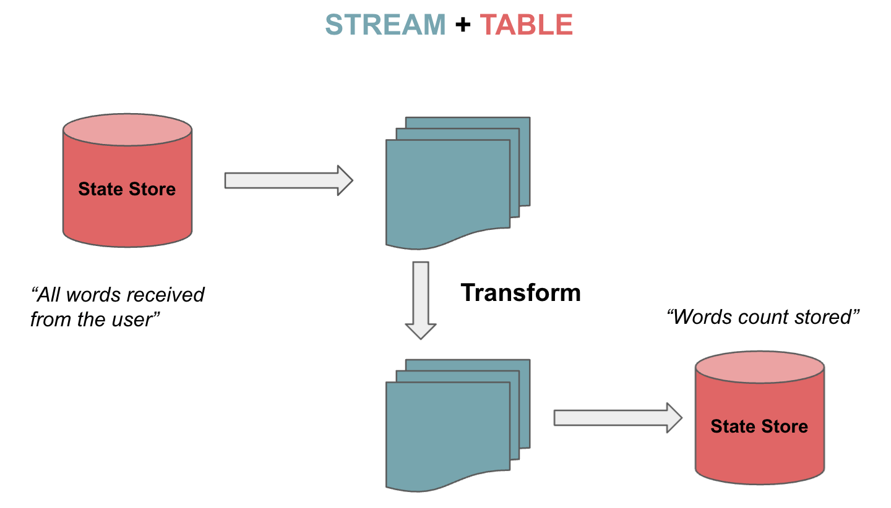

# kafka如何保证幂等性
首先简单介绍一下通常情况
1. 如果消息系统不能传递重复的消息,但是可能会丢失消息,那么这样的情况我们称为最多传递一次
2. 同理,如果消息系统不会丢失消息,但是存在传递重复消息的情况在,这就是所谓的最少传递一次
3. 既不会传递重复消息,也不会丢失消息,这种情况就是只有传递一次消息

起初的时候kafka只支持最多一次和最少一次的消息传递,引入了事务消息的概念以后,只传递一次功能kafka也支持。

## 什么是consume-transform-produce pattern
1. Sends a list of consumed offsets to the consumer group coordinator, 
  and also marks those offsets as part of the current transaction. 
  These offsets will be considered consumed only if the transaction is committed successfully. 
  This method should be used when you need to batch consumed and produced messages together, 
  typically in a consume-transform-produce pattern.
## 理解偏移量在消费中的作用
1. 如果还是以上的模型consume-transform-produce,如果集群不一致的话,那么需要使用
   applications that must read and write to different Kafka clusters 
   must use the older commitSync and commitAsync API;同时需要将偏移量记录
   在外部用于保证事务的读取

## 理解kafka consumer api 与 kafka stream api之间的不同
1. kafka consumer api 关键的功能
    - 1、生产者和消费者职责单独分离
    - 2、支持单个处理和批量处理
    - 3、仅无状态支持。客户端不保留先前的状态并单独评估流中的每个记录
    - 4、写应用程序需要很多代码
    - 5、不能使用线程处理或者并行处理
    - 6、可以在多个kafka集群进行写出操作
2. kafka stream api 关键的功能
    - 1、单个kafka stream用于消费和生产
    - 2、用于进行复杂的处理
    - 3、不支持批量处理
    - 4、支持无状态和有状态的操作
    - 5、写应用程序需要很少的d代码
    - 6、支持多线程和并行处理
    - 7、只能在一个单独的集群进行交互
    - 8、Kafka Streams 使用分区和任务的概念作为与主题分区紧密相关的逻辑单元。
3. 什么是kafka的流表二元性?
    - 1、Kafka Streams 支持流，但也支持可双向转换的表。这就是所谓的流表二元性。
    - 
      表格是一组不断变化的事实。每个新事件都会覆盖旧事件，而流是不可变事实的集合。
      流处理来自主题的完整数据流。表通过聚合来自流的信息来存储状态。
    - 2、理解KStream,KTable和GlobalKTable
      Kafka Streams 为 Streams 和 Tables 提供了两种抽象。KStream 处理记录流。
      另一方面，KTable 使用给定键的最新状态来管理变更日志流。每条数据记录代表一次更新。
      对于未分区的表还有另一种抽象。我们可以使用 GlobalKTables 向所有任务广播信息或进行连接，而无需重新分区输入数据。
4. 什么是kafka的DSL?
   - 1、Kafka Streams DSL 是一种声明式和函数式编程风格。
   - 2、无状态的转化和有状态的转换怎么理解
   - 3、
