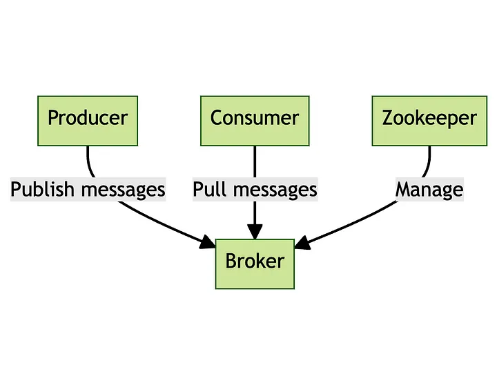
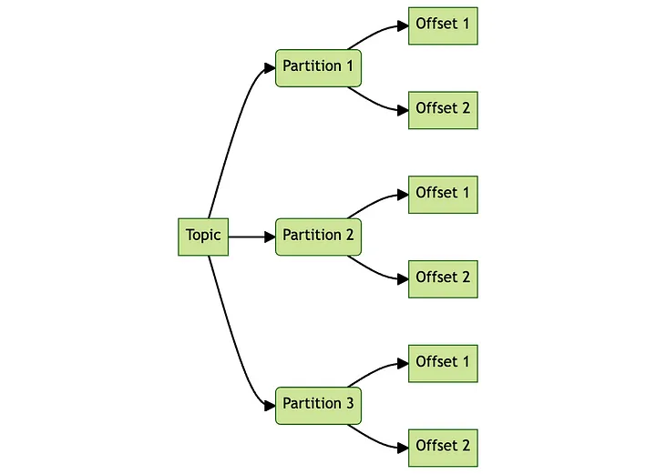
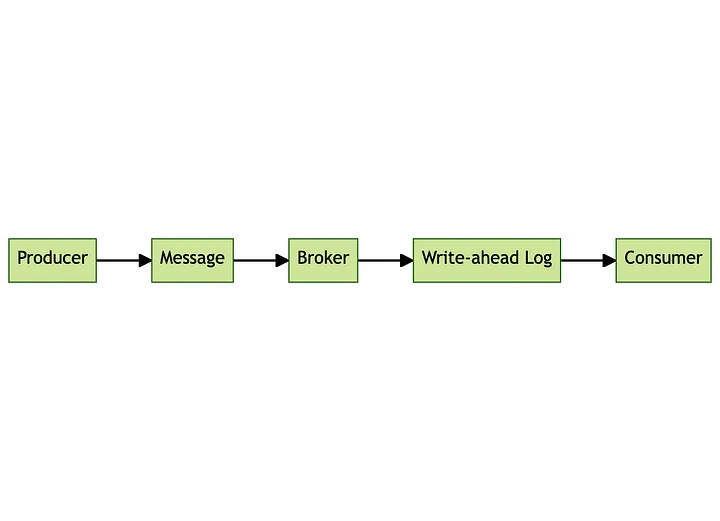
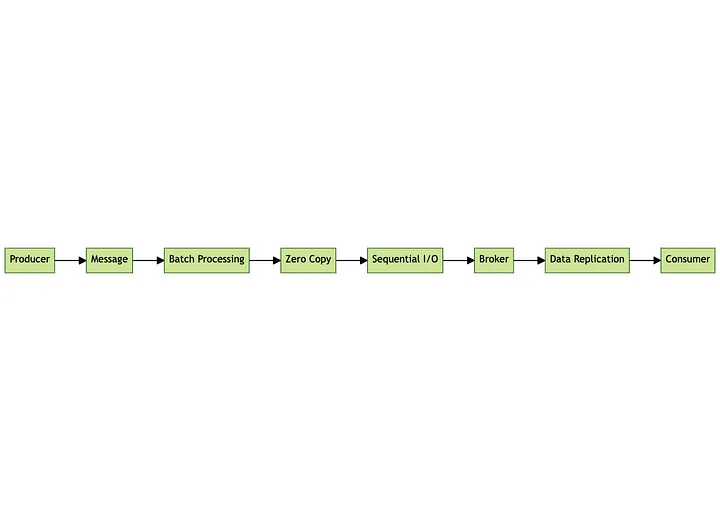
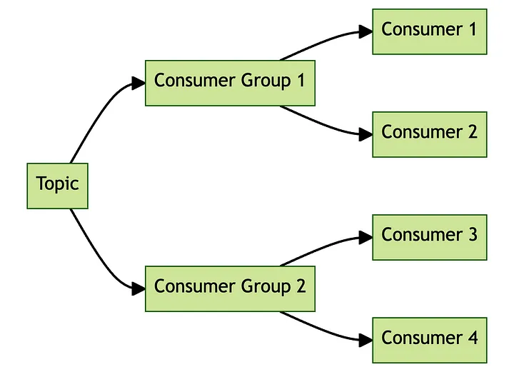

# kafka basic use case and core concepts

1. If we want to know more details about kafka,we can access link[kafka details](https://www.baeldung.com/tag/kafka "最好的kafka知识")
   and another article summary [more details](https://medium.com/cloud-native-daily/a-deep-dive-into-apache-kafka-unraveling-the-magic-behind-the-scenes-4233e1f00f6c)
   
   
   
   
   
   
2. kafka use case:
   - Real-time data processing and analytic
   - Log and event data aggregation
   - Monitoring and metrics collection
   - Clickstream data analysis
   - Fraud detection
   - Stream processing in big data pipelines