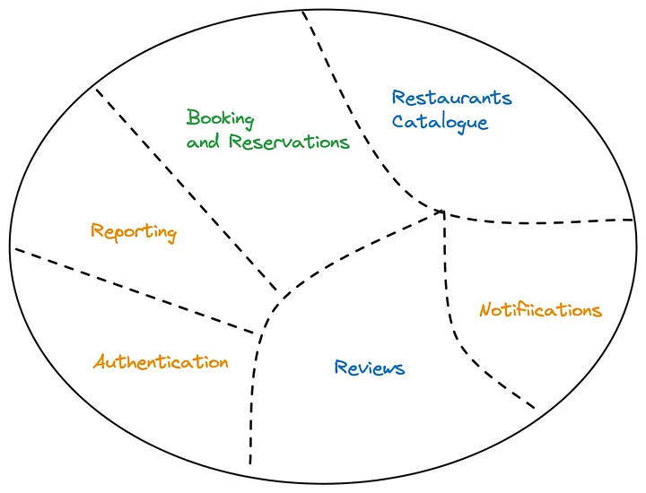
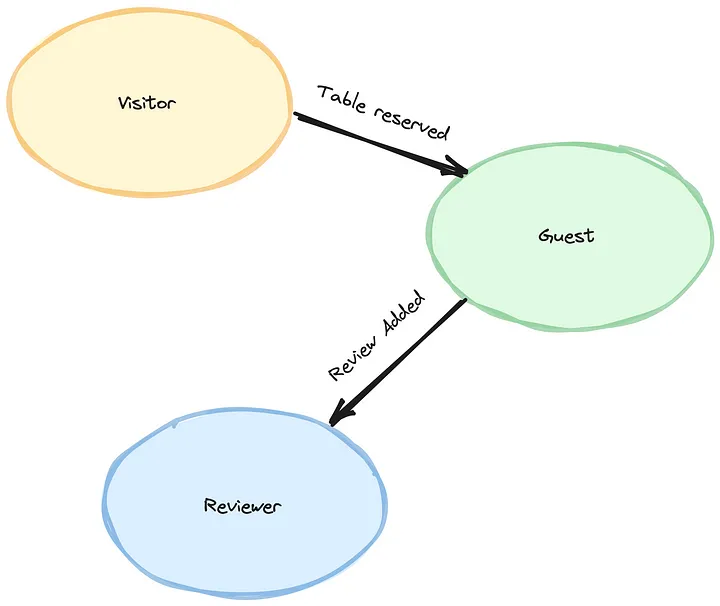

# 如何将大的领域划分为子域的一个例子

1. 这个例子采用的是在饭店预定桌位的实际用例来说明如何划分子域,[例子链接](https://levelup.gitconnected.com/strategic-ddd-by-example-subdomains-identification-4bd979f78370)
    从这个例子出发可以找出核心域,支撑域和通用域。
2. 具体的需求是:
   - Search: Allow users to search for restaurants based on criteria such as location, cuisine, price range, availability, and other relevant filters.
   - Visitor preferences: Allow users to provide a unique profile matching their culinary preferences.
   - Recommendations: Logic for generating personalized restaurant recommendations based on user preferences and history.
   - Restaurant Information: Display a list of restaurants that match the user’s search criteria, providing essential information such as restaurant name, location, opening hours, ratings, and customer reviews.
   - Table Availability: Provide real-time information on table availability, allowing users to select a suitable date and time for their reservation.
   - Reservation Booking: Enable users to reserve a table by specifying the desired date, time, number of guests, and any special requirements.
   - Reservation Confirmation: Send confirmation notifications to users upon successful reservation, providing them with the necessary details and any additional instructions.
   - Reservation Management: Allow users to view, modify, or cancel their existing reservations within a specified timeframe.
   - Guest Management: Capture guest information (name, contact details) during the reservation process to ensure efficient communication and service.
   - Restaurant Notifications: Send notifications to restaurant staff regarding incoming reservations, cancellations, and any special requests or requirements from guests.
   - Reporting: Generate reports and analytics related to reservation patterns, occupancy rates, popular time slots, and other relevant metrics to help optimize restaurant operations.
   - Restaurant Reviews: Allow users to leave reviews and ratings for restaurants they have visited.
   - Review supervising: Implement moderation or content guidelines to ensure the quality and appropriateness of reviews.
   - Authentication: Validate the identity of a registered user.
3. 最终的子域如下:
    
4. 不同的用户在不同的子域中有不同的统一语言
    
5. 以上文章中还有一个例子就是使用一个电子医疗记录的实际例子来说明如何定义核心域和支撑域